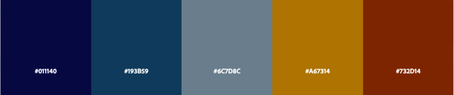
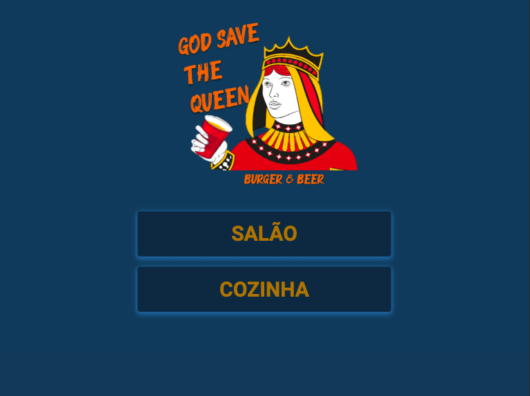

# BURGER QUEEN

"Burger Queen" refere-se ao projeto desenvolvido durante o bootcamp da Laboratória, que tinha por obejtivo o aprendizado da construção de uma interface web usando React, _framework_ front-end que ataca o problema de manter  interface e estado sincronizados.

***
## Índice 
1. [Resumo do Projeto](#1-resumo-do-projeto)
2. [Como Usar](#2-como-usar)
3. [Tecnologias Envolvidas](#3-tecnologias-do-projeto)
***
## 1. Resumo do Projeto

"God Save the Queen - Burger & Beer" é um pequeno restaurante de hambúrgueres que está crescendo e necessita uma interface em que se possa realizar pedidos utilizando um tablet, e enviá-los para a cozinha para que sejam preparados de forma ordenada e eficiente.

O projeto consiste em uma interface a ser utilizada pelo garçom, em que todos os produtos oferecidos pelo estabelecimento ficam disponíveis, separados em duas categorias "café da manhã" e "almoço e janta". 
A medida que os clientes realizam os pedidos o garçom consegue adicionar e retirar itens da lista, obtendo ao final um resumo do pedido com o preço da conta final já calculado. 

### Paleta de Cores

A paleta de cores utilizada foi inspirada nas cores da Boréale’s polar bear, indústria canadense de cerveja. 

***

### 2. Como Usar

**Interface Inicial do Aplicativo**

**Figura 1.** Interface inicial de entrada do aplicativo.

**Interface do Salão**

**Figura 2.** Interface utilizada pelo garçom para realizar os pedidos, incluido resumo com total da conta.

Paralelamente a equipe da cozinha recebe os pedidos a serem preparados, podendo encaminhá-lo de volta para que o garçom saiba quando realizar a entrega e, tendo acesso ao histórico de pedidos realizados.

**Interface da Cozinha**

**Figura 3.** Interface visualizada pela equipe da cozinha, com histórico de pedidos e opção de marcar os pedidos como "preparados".

***
## 3. Tecnologias e Ferramentas Envolvidas

* HTML5
* JavaScript (ES6)
* Aphrodite (CSS)
* React Hooks
* Firebase
* alertifyjs
* @material-ui
* fortawesome/react-fontawesome
* Trello

***